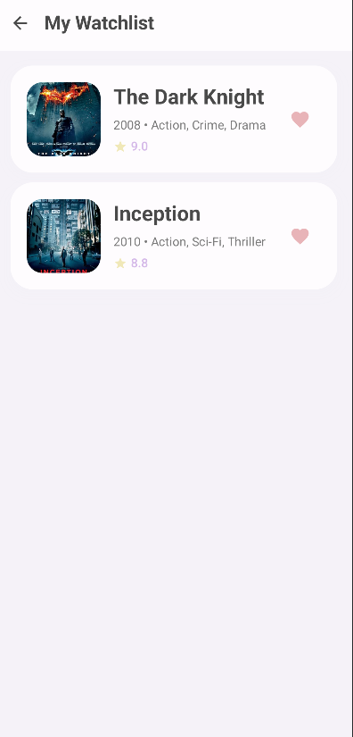

# Movie Explorer App

A multi-screen Android app built with Jetpack Compose that demonstrates fundamental Android development concepts.




## Features

- **Home Screen**: Displays a list of movies with posters and titles
- **Details Screen**: Shows detailed movie information including description and rating
- **Watchlist Screen**: Manages user's favorite movies
- **State Management**: Uses ViewModel to manage data across screens
- **Navigation**: Seamless navigation between screens using Jetpack Navigation
- **Add/Remove Watchlist**: Toggle movies in and out of watchlist

## Technical Implementation

### Architecture Components Used
- **Jetpack Compose**: Modern UI toolkit for building native Android apps
- **ViewModel**: Manages UI-related data and survives configuration changes
- **StateFlow**: Reactive state management for UI updates
- **Navigation Compose**: Type-safe navigation between screens
- **Coil**: Image loading library for movie posters

### Key Concepts Demonstrated
1. **State Management**: Using `StateFlow` and `collectAsState()` for reactive UI updates
2. **ViewModel**: Centralized data management and business logic
3. **Navigation**: Screen-to-screen navigation with parameter passing
4. **Compose UI**: Declarative UI with Material Design 3
5. **Data Classes**: Structured data representation
6. **Repository Pattern**: Centralized data source management

## Project Structure

```
app/src/main/java/com/example/cpsc411mid_termproject/
├── data/
│   └── Movie.kt                 # Data classes and repository
├── navigation/
│   └── MovieNavigation.kt       # Navigation setup
├── ui/screens/
│   ├── HomeScreen.kt           # Movie list screen
│   ├── DetailsScreen.kt        # Movie details screen
│   └── WatchlistScreen.kt      # User's watchlist
├── viewmodel/
│   └── MovieViewModel.kt       # State management
└── MainActivity.kt             # App entry point
```

## Sample Data

The app includes 8 popular movies with:
- Movie titles and descriptions
- IMDb ratings
- Release years and genres
- Poster images (loaded from URLs)

## Getting Started

1. Clone the repository
2. Open in Android Studio
3. Sync project with Gradle files
4. Run on device or emulator

## Requirements

- Android Studio Arctic Fox or later
- Minimum SDK: 24 (Android 7.0)
- Target SDK: 36 (Android 14)
- Kotlin 2.0.21
- Jetpack Compose BOM 2024.09.00

## Team Project Members
- An Nguyen - Email: AnNguyen0410@csu.fullerton.edu - CWID: 885598904
- Liam Dwane - Email: lpdwane@csu.fullerton.edu - CWID: 888470812
- Tri Bui - Email: triminhbui@csu.fullerton.edu - CWID: 885242487
- Kendrik Deleoz - Email: kendrikdeleoz@csu.fullerton.edu - CWID: 886859461

## Youtube Unlisted Video
https://youtube.com/shorts/6Rt8YBZMBK0?feature=share
